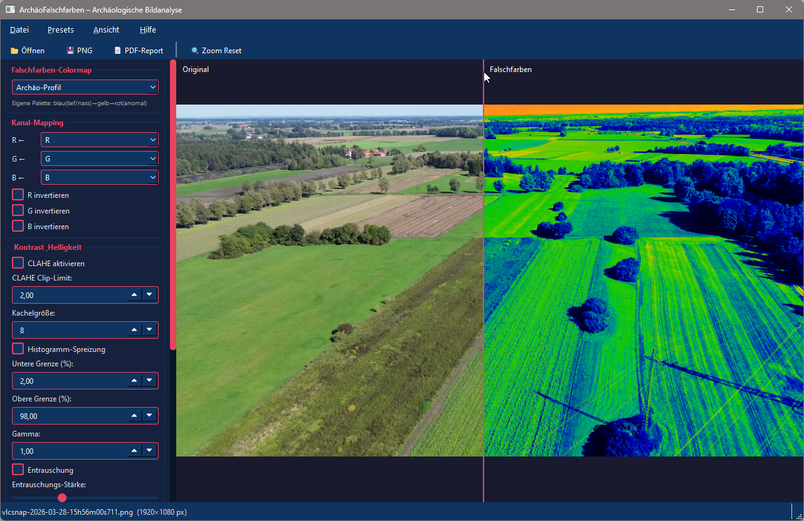

# ArchäoFalschfarben – Archaeological False-Color Analysis

A desktop application for false-color analysis of aerial and drone images, designed to reveal buried archaeological features such as crop marks, soil marks, and micro-topography.

> **Note:** The user interface is in German.



---

## Features

- **10 false-color colormaps** – including Infrared Simulation, Thermal Jet, NDVI Proxy, Archaeo Profile, HSV False Color, and more
- **Split-view comparison** – original and result side by side with a draggable divider
- **Zoom & pan** – mouse-wheel zoom (anchored at cursor), click-drag pan, fit-to-canvas on load
- **Channel remapping & inversion** – freely reassign R/G/B channels
- **Enhancement tools** – CLAHE, histogram stretch, gamma correction, denoising
- **Edge detection** – Sobel, Scharr, Canny, Laplacian, LoG with overlay
- **Archaeology-specific filters** – Crop Mark Enhancement, Soil Mark Enhancement, Shadow/Hillshade Relief
- **Preset system** – save and reload analysis configurations
- **Export** – PNG, TIFF, single-colormap PDF report, or all-colormaps PDF report
- **Drag & drop** support for JPG, PNG, GIF, TIFF

### All-Colormaps PDF Example
[→ Sample PDF with all colormaps](images/Sample_all_colormaps.pdf)

---

## Requirements

- **Windows** (tested on Windows 10/11)
- **Python 3.11 or newer** – [Download](https://www.python.org/downloads/)

All Python dependencies are installed automatically on first launch.

---

## Installation & Launch

1. Clone or download this repository
2. Double-click `start.bat`

That's it. The script will:
- Create a virtual environment (`venv/`)
- Install all dependencies once (~150 MB)
- Launch the application

For subsequent launches, `start.bat` starts immediately.

### Manual launch (PowerShell)
```powershell
.\start.ps1
```

### Manual launch (command line)
```bash
python -m venv venv
venv\Scripts\python.exe -m pip install -r requirements.txt
venv\Scripts\python.exe main.py
```

---

## Dependencies

| Package | Purpose |
|---|---|
| PyQt6 ≥ 6.5 | GUI framework |
| OpenCV ≥ 4.8 | Image processing, CLAHE, edge detection |
| NumPy ≥ 1.24 | Array operations |
| Pillow ≥ 10.0 | Image loading (JPG/GIF/PNG/TIFF) |
| matplotlib ≥ 3.7 | PDF report generation |
| scikit-image ≥ 0.21 | Additional image processing |

---

## Project Structure

```
ArchäoFalschfarben/
├── main.py                  # Entry point
├── start.bat                # Windows launcher (auto-installs deps)
├── start.ps1                # PowerShell launcher
├── requirements.txt
├── core/
│   ├── image_loader.py      # Load & normalize images
│   ├── colormap_engine.py   # 10 false-color algorithms
│   ├── band_manipulator.py  # Channel remapping & inversion
│   ├── enhancement.py       # CLAHE, histogram stretch, gamma, denoise
│   ├── edge_detector.py     # Edge detection methods
│   ├── special_filters.py   # Archaeology-specific filters
│   └── exporter.py          # PNG/TIFF/PDF export
├── gui/
│   ├── main_window.py       # Main window & orchestration
│   ├── control_panel.py     # Settings sidebar
│   └── preview_canvas.py    # Split-view canvas with zoom/pan
├── presets/
│   └── profiles.json        # Saved analysis presets
├── images/                  # Screenshots & sample output
└── DOKUMENTATION.md         # Full documentation (German)
```

---

## Use Cases

This tool is aimed at archaeologists and aerial survey analysts who want to quickly apply and compare multiple false-color transformations to find:

- **Crop marks** – differential vegetation growth above buried ditches, pits, or walls
- **Soil marks** – color differences in ploughed fields revealing buried features
- **Shadow marks / micro-topography** – subtle elevation differences visible through directional shading

---

## License

MIT License – see [LICENSE](LICENSE) for details.
